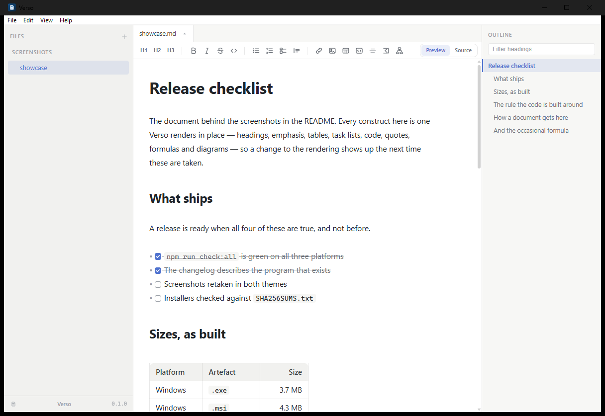
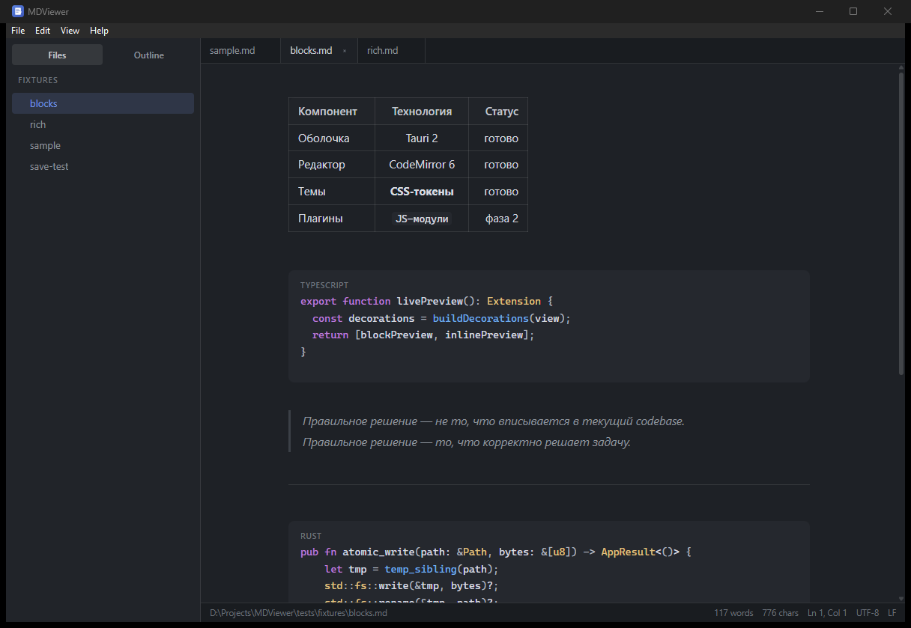
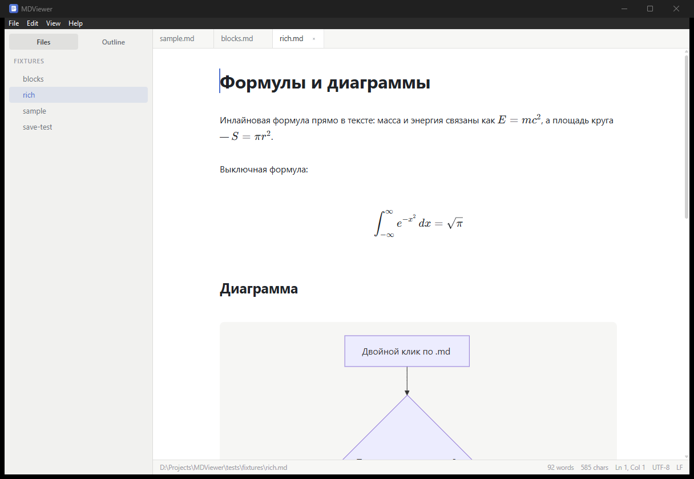

<div align="center">

# Verso

**A beautiful, instant Markdown viewer and editor.**

Double-click a `.md` file — it opens in well under a second and looks like a
finished document, not like source code.

*verso* — the left-hand page of an open book.

[](https://github.com/vglu/verso/actions/workflows/ci.yml)
[](LICENSE)
[](https://tauri.app)



</div>

## Why

| | |
| --- | --- |
| **Typora** | Beautiful, but closed and paid. |
| **MarkText** | Electron, ~150 MB, and years of dormancy behind it. |
| **Obsidian** | A vault-shaped knowledge base, not "just open this file". |

Verso is viewer-first: it opens instantly, renders beautifully, lets you
edit in place, and never damages your file.

## What it does

- **Formats what it opens.** JSON laid out or minified, CSV turned into a
  Markdown table — one undoable edit, from View → Format Document. Data files
  open as themselves, with their own highlighting, rather than being read as
  Markdown.
- **Live preview like Typora.** Markdown renders in place; the raw syntax
  appears only on the line your caret touches — and only once you actually
  start interacting, so a freshly opened document stays a clean reading page.
- **Real tables**, not aligned pipes. Column alignment, inline formatting in
  cells, click a cell to edit its source.
- **Math and diagrams.** `$E = mc^2$` via KaTeX, ` ```mermaid ` fences via
  Mermaid — both loaded only when a document needs them.
- **Tabs, folder tree, outline, find & replace**, session restore, section
  folding, go-to-heading.
- **Export and print.** A standalone HTML file that carries its own styles,
  pictures, diagrams and formulas — and the print dialog, which is where
  "Save as PDF" lives.
- **Light and dark themes** built from CSS tokens — [write your own](docs/themes.md)
  and Verso repaints as you save the file. Three ship in `docs/themes/`,
  including a Minecraft palette and a soft rose one; every colour in them is
  measured against WCAG rather than eyeballed.
- **Plugins** that add formatters, [in about thirty lines](docs/plugins.md).
  They run in a worker with no DOM, no file system and no network, and none of
  their code runs until you switch them on.
- **Opens what other editors will not.** UTF-8, UTF-16, and the eight-bit
  encodings everything written before UTF-8 is in: windows-1251, DOS 866,
  KOI8-R/U, ISO 8859-5, windows-1252 — saved back byte for byte.
- **Spell checking, if you want it** — the system's own dictionaries, in
  whatever languages your computer speaks. Off by default.
- **Zoom the whole window** (`Ctrl+=` / `Ctrl+-` / `Ctrl+0`, or `Ctrl` and the
  wheel) from 50% to 300%.
- **English and Ukrainian interface**, following the system language unless you
  choose one.
- **3.8 MB installer, ~40 MB of RAM.** Tauri 2 and the system webview, no
  bundled browser. (The Linux AppImage is the exception at ~79 MB — it carries
  its own runtime; the `.deb` and `.rpm` are 4.5 MB.)

### Your file is safe

- Saves are atomic — the file on disk is the old version or the new one, never
  a half-written mix.
- Encoding, line endings and BOM are preserved: **open and save an untouched
  file and the bytes are identical.**
- Unsaved text is mirrored to a draft, so a crash costs nothing.
- Files that change under you reload when the tab is clean, and ask when it
  isn't.
- Raw HTML in a document is displayed as text, never executed.



Math and diagrams render inline, and only load when a document actually uses them:



## Install

Download the installer for your system from the
[latest release](https://github.com/vglu/verso/releases/latest):

| System | File |
| --- | --- |
| Windows | `Verso_0.2.0_x64-setup.exe` (3.7 MB) or the `.msi` |
| macOS | `Verso_0.2.0_x64.dmg`, or `_aarch64.dmg` on Apple silicon |
| Linux | `.deb`, `.rpm`, or the `.AppImage` if your distribution is neither |

Every file is listed in `SHA256SUMS.txt` beside them; check it if you like:
`sha256sum -c SHA256SUMS.txt`.

Or build it yourself:

```bash
npm ci
npm run tauri build
```

Requires Node 22+ and a stable Rust toolchain. On Linux you also need
`libwebkit2gtk-4.1-dev` and the usual GTK build dependencies (see
[`.github/workflows/ci.yml`](.github/workflows/ci.yml)).

### About the warning you will see

The installer is not code-signed — a certificate costs a few hundred dollars a
year, which is not something a free project carries. Windows SmartScreen will
say "unknown publisher": choose **More info → Run anyway**. macOS will need
**right-click → Open** the first time. If that is not a trade you want to
make, building from source above gives you the same application without it.

## Develop

```bash
npm ci
npm run tauri dev      # run the app with hot reload
npm run check:all      # lint, types, theme-token guard, unit tests, clippy
```

| Layer | Stack |
| --- | --- |
| Shell | Tauri 2 (Rust) — file associations, single instance, filesystem, watching |
| UI | Svelte 5 + Vite + TypeScript |
| Editor | CodeMirror 6 with a custom live-preview decoration layer |

Design documents live in [`docs/design/`](docs/design/): architecture, the
IPC contract, the editor core, data-safety rules and the design system.
Decisions are recorded as [ADRs](.cursor/decisions/).

## Documentation

- [User guide](docs/guide/README.md) — shortcuts, saving, recovery
- [Writing a theme](docs/themes.md) — the token contract, and how to measure one
- [Plugins](docs/plugins.md) — using them, and writing one
- [Changelog](CHANGELOG.md)

## Status

**0.2, released.** Everything described above works, and is built and used on
Windows every day: the Windows installer has been installed from the release
and checked — file association, "Open with", and a clean uninstall. macOS and
Linux are built by CI on every commit, and their installers have not yet been
run by hand — treat those two as untested rather than unsupported, and please
open an issue if something there is wrong.

Not there yet: folder-wide search, renaming or deleting files from the tree,
and plugins that do anything other than formatting. See the [changelog](CHANGELOG.md) for the current limits.

## License

[MIT](LICENSE) © SIMS tech. Part of the [SIMS tech](https://sims-service.com/products)
product line.
