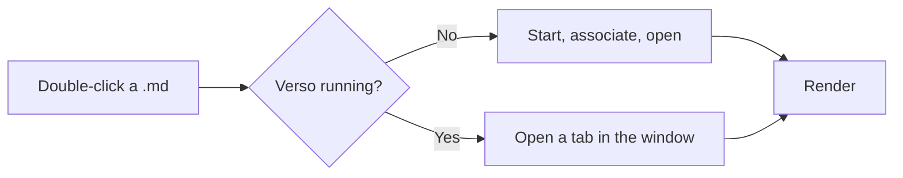

# Release checklist

The document behind the screenshots in the README. Every construct here is one
Verso renders in place — headings, emphasis, tables, task lists, code, quotes,
formulas and diagrams — so a change to the rendering shows up the next time
these are taken.

## What ships

A release is ready when all four of these are true, and not before.

- [x] `npm run check:all` is green on all three platforms
- [x] The changelog describes the program that exists
- [ ] Screenshots retaken in both themes
- [ ] Installers checked against `SHA256SUMS.txt`

## Sizes, as built

| Platform | Artefact | Size |
| :------- | :------- | ---: |
| Windows  | `.exe`   | 3.7 MB |
| Windows  | `.msi`   | 4.3 MB |
| macOS    | `.dmg`   | 4.2 MB |
| Linux    | `.deb`   | 4.5 MB |
| Linux    | AppImage | 78.6 MB |

The AppImage carries its own runtime, which is where the difference goes.

> Everything else uses the webview the operating system already has. That is
> the whole reason a Markdown viewer can be four megabytes instead of a
> hundred and fifty.

## The rule the code is built around

The file's text *is* the document. Rendering is decoration drawn over it, so
opening a file and saving it back produces identical bytes — the same encoding,
the same line endings, down to a file that mixes `CRLF` and `LF`.

```ts
// The whole promise, as a test.
const opened = decode(original);
const written = encode(opened.content, opened.encoding, opened.lineEndings);
expect(written).toEqual(original);
```

## How a document gets here



## And the occasional formula

Inline, in the middle of a sentence: the area of a circle is $S = \pi r^2$,
and mass and energy are related by $E = mc^2$.

Set on its own, the way a display formula should be:

$$
\int_{-\infty}^{\infty} e^{-x^2}\,dx = \sqrt{\pi}
$$

---

*Written in Verso, rendered by Verso, exported by Verso.*
