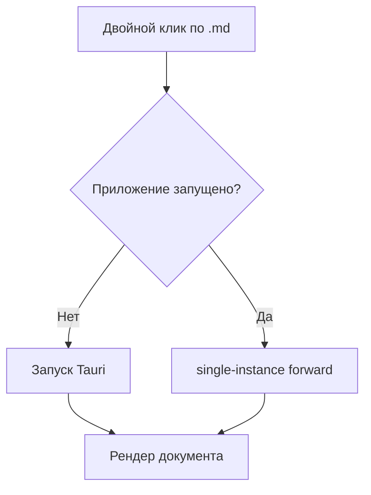

# Формулы и диаграммы

Инлайновая формула прямо в тексте: масса и энергия связаны как $E = mc^2$, а площадь круга — $S = \pi r^2$.

Выключная формула:

$$
\int_{-\infty}^{\infty} e^{-x^2}\,dx = \sqrt{\pi}
$$

## Диаграмма



## Проверка ложных срабатываний

Цена $5 и ещё $10 — это не формулы. Переменные `$HOME` и `$PATH` в коде тоже.

```sh
echo $HOME
echo $PATH
```

Обычный текст после всех блоков.
